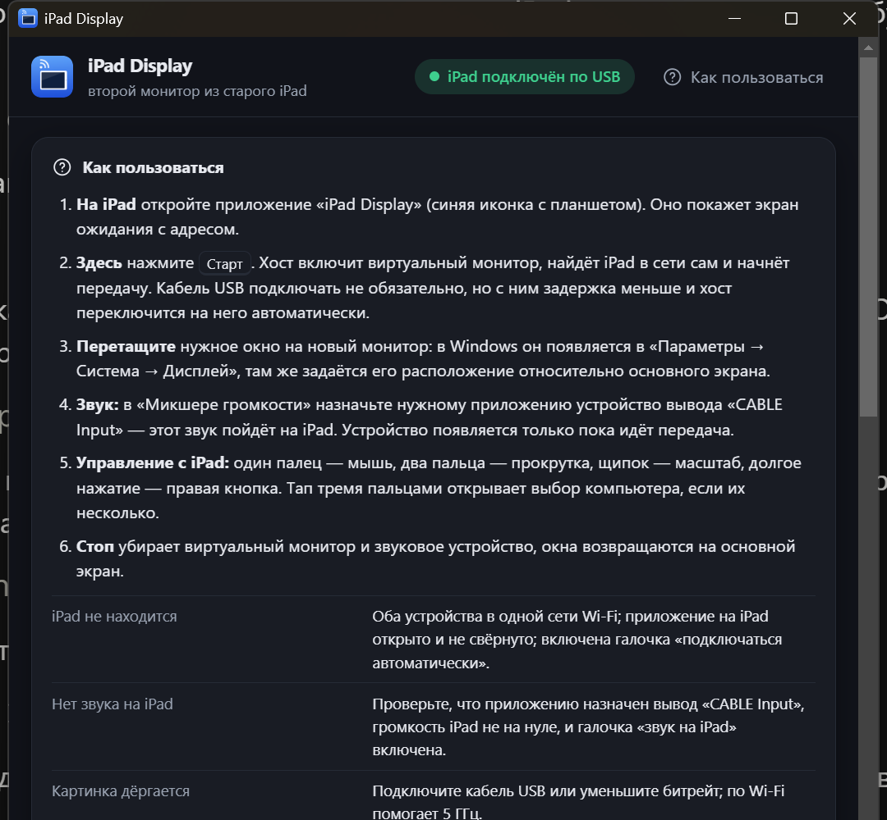

# iPad Display — старый iPad как второй монитор для Windows и macOS

Превращает iPad в дополнительный экран компьютера: картинка с аппаратным H.264 до 60 fps, системный
звук, управление курсором касаниями и жестами. Работает на устройствах, которым отказали Sidecar, Duet
и Luna, — вплоть до iPad mini 1 / iPad 2 на iOS 9.3.5.



- **Второй монитор, а не зеркало**: хост создаёт виртуальный дисплей 1024×768, и окна, перетащенные
  на него, появляются на iPad.
- **Два пути на iPad**: нативное приложение (H.264, звук, жесты, работа по кабелю) или просто Safari,
  без установки чего-либо.
- **Подключение само**: iPad объявляет себя в сети, хост его находит; воткнутый кабель USB
  используется автоматически как более быстрый и стабильный канал.
- **Ничего лишнего после работы**: на «Стоп» виртуальный монитор отцепляется, звуковое устройство
  исчезает из системы, окна возвращаются на основной экран.

---

## Требования

| Что | Минимум | Проверено на |
|---|---|---|
| Компьютер | Windows 10/11 или macOS 12+, Node.js 18+ | Windows 11 + RTX 3070 Ti, macOS 26.5 (M4 Pro) |
| iPad | любой с Safari и WebSocket (iOS 6+) | iPad mini 1 (A1432), iOS 9.3.5 |
| Для нативного приложения | джейлбрейк + OpenSSH на iPad | EverPwnage 2.0.1 + iocaste, iOS 9.3.5 |
| Для кабеля USB | usbmuxd на компьютере | «Apple Devices» из Microsoft Store / встроенный в macOS |
| Аппаратный кодек | ffmpeg | 9.0.1 (Windows), 8.1 (macOS) |
| Звук отдельным устройством | VB-CABLE (Windows) или BlackHole (macOS) | оба |

Сеть: iPad и компьютер в одной сети Wi-Fi. Для кабеля сеть не нужна.

---

## Готовые сборки

Каждый push в `main` собирает в GitHub Actions (workflow `build`) три артефакта, а тег `v*` публикует
их на странице **[Releases](https://github.com/manar-mk/ipad-display/releases)**:

| Файл | Что это |
|---|---|
| `iPad Display-<версия>-setup-win-x64.exe` | установщик для Windows (NSIS); `…-portable-win-x64.exe` — тот же хост без установки, просто запускается |
| `iPad Display-<версия>-mac-arm64.dmg` / `-mac-x64.dmg` (и `.zip`) | приложение для macOS на Apple Silicon / Intel |
| `IPadDisplay-iPad-app.zip` | приложение для iPad (armv7, iOS 9); ставится по инструкции [docs/IPAD-APP.md](docs/IPAD-APP.md) |

Сборки не подписаны: Windows SmartScreen — «Подробнее → Выполнить в любом случае»; macOS — правый клик
по приложению → «Открыть» (или `xattr -d com.apple.quarantine "/Applications/iPad Display.app"`).
Хосту всё равно нужны ffmpeg (и на Windows — «Apple Devices» для кабеля, на macOS — BlackHole для звука):
команды ниже. Собрать локально: `npm install && npm run dist` (на macOS перед этим `npm run helpers:mac`).

## Установка из исходников

### 1. Хост на Windows

```bash
git clone https://github.com/manar-mk/ipad-display
cd ipad-display
npm install
winget install Gyan.FFmpeg                 # аппаратный H.264 через Media Foundation
winget install 9NP83LWLPZ9K --source msstore   # «Apple Devices»: даёт usbmuxd для кабеля
```

Дополнительно:

- **Виртуальный монитор** — кнопка «Установить виртуальный монитор 1024×768» в первом блоке панели
  (драйвер [Virtual Display Driver](https://github.com/VirtualDrivers/Virtual-Display-Driver), MIT,
  лежит в `driver/windows/`). Windows спросит подтверждение администратора.
- **Звук отдельным устройством** — поставьте [VB-CABLE](https://vb-audio.com/Cable/). В системе
  появится вывод «CABLE Input»: всё, что на него направлено, уходит на iPad.
- **Ярлык на рабочем столе** создаётся командой:

```bash
node tools/make-shortcut.js
```

### 2. Хост на macOS

```bash
git clone https://github.com/manar-mk/ipad-display
cd ipad-display
npm install
xcode-select --install        # swiftc для помощников driver/macos (собираются сами)
brew install ffmpeg           # захват avfoundation + аппаратный H.264 VideoToolbox
brew install blackhole-2ch    # виртуальное аудиоустройство (спросит пароль администратора)
```

Разрешения в Системных настройках → Конфиденциальность и безопасность (панель подскажет, чего не хватает):
**Запись экрана** (после включения перезапустить хост), **Универсальный доступ** (касания как мышь),
**Микрофон** (чтение BlackHole). Виртуальный монитор macOS-хост создаёт сам при запуске.

### 3. iPad

Без установки — **Safari**: запустите хост и отсканируйте QR-код из блока «Без приложения».
Картинка будет в JPEG, 10–15 fps, звук включается тапом по экрану.

Полноценно — **нативное приложение** (H.264 60 fps, звук, жесты, USB):
см. отдельную инструкцию **[docs/IPAD-APP.md](docs/IPAD-APP.md)**.

---

## Запуск

1. Откройте **iPad Display** на компьютере (ярлык на рабочем столе или `npm start`).
2. Откройте **iPad Display** на iPad.
3. Нажмите **Старт**. Хост включит виртуальный монитор, найдёт iPad и начнёт передачу; плашка в шапке
   покажет «iPad подключён по Wi-Fi» или «по USB».
4. Перетащите нужные окна на новый монитор (в Windows он виден в Параметры → Система → Дисплей,
   там же настраивается его положение относительно основного экрана).
5. **Стоп** завершает работу и убирает за собой монитор и звуковое устройство.

Кнопка «Как пользоваться» в шапке панели открывает ту же инструкцию и разбор частых проблем
прямо в приложении.

### Управление с iPad

| Жест | Действие |
|---|---|
| Один палец | мышь: тап — клик, движение — перетаскивание |
| Два пальца | прокрутка (вертикальная и горизонтальная) |
| Щипок | масштаб (Ctrl+колесо, на macOS ⌘+колесо) |
| Долгое нажатие | правая кнопка мыши |
| Тап тремя пальцами | выбор компьютера, если их несколько |

### Звук

Системный звук идёт на iPad как PCM 22050 Гц моно.

На **macOS** кнопка «Сделать iPad звуковым устройством» создаёт два устройства вывода и сразу включает первое:

| Устройство | Где играет звук |
|---|---|
| **iPad Display** | только на iPad — Mac молчит, как при подключении монитора с колонками |
| **iPad Display + динамики** | одновременно на iPad и на динамиках Mac |

Переключаются они в Системные настройки → Звук → Вывод, вернуть звук на Mac можно там же.
Удалить оба: `driver/macos/audiosetup --remove`.

На **Windows** ту же роль играет VB-CABLE: вывод «CABLE Input». Чтобы отправить на iPad только одно
приложение, назначьте ему это устройство (Параметры → Система → Звук → Микшер громкости; на macOS —
в настройках самого приложения). Устройство кабеля существует только пока идёт передача.

Переключать системное устройство по умолчанию хост умеет (галочка «делать его устройством по
умолчанию»), но утилиты вроде Nahimic и Realtek Audio Console возвращают своё через несколько секунд —
поэтому по умолчанию галочка выключена.

---

## Что делает хост по умолчанию

- Выбирает виртуальный монитор (второй экран 4:3), на macOS сначала создаёт его.
- Начинает захват сразу при запуске, включает звук и приём касаний.
- Слушает UDP-маячки приложения iPad (порт 7802) и подключается сам; кабель имеет приоритет над Wi-Fi.
- На «Стоп» и при закрытии окна отцепляет виртуальный монитор и прячет звуковые устройства кабеля.

Настройки: `%APPDATA%\ipad-display\settings.json` (macOS: `~/Library/Application Support/ipad-display/`).

---

## Диагностика

| Проблема | Что проверить |
|---|---|
| iPad не находится | Приложение на iPad открыто; устройства в одной сети; включена галочка «подключаться автоматически» (плашка в шапке предупредит, если она снята) |
| Нет звука на iPad | Приложению назначен вывод «CABLE Input»; галочка «звук на iPad»; громкость iPad; журнал `node tools/ssh.js "cat /tmp/ipaddisplay.log"` |
| Картинка дёргается | Подключите кабель USB, уменьшите битрейт; по Wi-Fi помогает 5 ГГц |
| Нет виртуального монитора | Кнопка установки в первом блоке панели; на macOS — сообщение об ошибке CGVirtualDisplay, запасной путь DeskPad |
| Приложение пропало с iPad | После перезагрузки iPad джейлбрейк не активен: запустите EverPwnage → Jailbreak, затем «iPad Display» |
| iPad показывает другой компьютер | На iPad тап тремя пальцами → выберите нужный хост или «Любой хост» |

Полезные команды:

```bash
node tools/device-info.js                       # iPad по USB: модель, iOS, открытые порты
node tools/usbmux-list.js                       # usbmuxd и туннель к iPad
node tools/list-apps.js Any                     # какие приложения стоят на iPad
node tools/ssh.js "cat /tmp/ipaddisplay.log"    # журнал звука приложения (Wi-Fi: IPAD_SSH_HOST=<ip>)
node tools/test-client.js ws://127.0.0.1:7800/ 3 # кадры по WebSocket + тестовое касание
```

---

## Как это устроено

```
┌──────────────── компьютер (Electron) ────────────────┐        ┌──────── iPad ────────┐
│ виртуальный монитор → ffmpeg (аппаратный H.264)      │ Wi-Fi  │ IPadDisplay.app      │
│                     → TCP 7801 ──────────────────────┼───────►│ AVSampleBufferLayer  │
│ виртуальный аудиокабель → ffmpeg → PCM 22050 ────────┼─ USB ─►│ AudioQueue           │
│ HTTP + WebSocket 7800 (JPEG для Safari) ◄────────────┼────────┤ касания, жесты       │
└──────────────────────────────────────────────────────┘        └──────────────────────┘
```

Протокол к приложению: `[uint32 длина][тип][данные]`. От хоста — `H` (avcC), `V` (кадр H.264),
`J` (JPEG), `F`/`A` (формат и данные звука), `N` (имя хоста). От iPad — ack кадра, `T` (касание),
`S` (прокрутка), `Z` (масштаб), `R` (правая кнопка), `K` (нужен ключевой кадр), `P` (кадр показан,
по нему считается задержка), `X` (выбран другой хост).

Обнаружение: iPad каждые 2 с шлёт UDP «IPADDISPLAY 7801» (плюс «busy», если уже занят), хосты
отвечают своим именем — из этого и строится список компьютеров на iPad.

**Кодеки.** H.264 — основной: Media Foundation (Windows) или VideoToolbox (macOS) кодируют аппаратно,
iPad декодирует аппаратно; 60 fps при 1024×768, 2–8 Мбит/с, задержка сеть+декодер 5–9 мс.
JPEG — для Safari (в iOS 9 нет Media Source Extensions) и как запасной путь, 10–15 fps.

**Bluetooth не поддерживается намеренно:** сторонним приложениям на iOS доступен только BLE
(десятки КБ/с), а картинке нужно 1–2 МБ/с.

---

## Структура

| Файл | Назначение |
|---|---|
| `main.js` | Electron main: HTTP/WebSocket 7800, клиент к приложению (USB/TCP), обнаружение, касания, уборка сессии |
| `panel.html`, `preload.js` | окно хоста: захват, JPEG, WebCodecs, настройки, инструкция |
| `ffenc.js` | внешний аппаратный H.264 и захват звука через ffmpeg, разбор Annex B |
| `usbmux.js` | клиент usbmuxd: список устройств и туннель к порту iPad без iproxy |
| `client/index.html` | веб-клиент для Safari (ES5, совместим с iOS 9) |
| `ios/` | нативное приложение (Objective-C, iOS 9) + `build.sh` + `tools/sblaunch.c` |
| `driver/windows/` | Virtual Display Driver, `install-vdd.ps1`, `session.ps1` (монитор и звук по сессии) |
| `driver/macos/` | `vdisplay.swift`, `mousehelper.swift`, `audiosetup.swift` |
| `tools/` | установка на iPad, SSH, диагностика, генератор иконок, эмуляторы |
| `assets/` | иконки приложения (`node tools/make-icons.js` рисует их без графических редакторов) |
| `docs/IPAD-APP.md` | установка приложения на iPad |
| `docs/macos-host-prompt.md` | задание для сессии, портирующей хост на macOS |

Переменные окружения: `IPAD_DISPLAY_PORT` (порт HTTP, 7800), `IPAD_DISPLAY_AUTOSTART=1`,
`IPAD_DISPLAY_TCP=host:port` или `=usb`, `IPAD_DISPLAY_FFMPEG=<путь>`, `IPAD_SSH_HOST`, `IPAD_SSH_PASS`.

---

## Ограничения

- iPad mini 1 не Retina: размер больше 1024×768 только увеличивает трафик.
- Звук без сжатия (~350 кбит/с), задержка 0.2–0.5 с; HDCP-защищённый контент не захватывается.
- Профиль джейлбрейка слетает при перезагрузке iPad — приложение нужно запускать после повторного
  джейлбрейка (см. docs/IPAD-APP.md).
- Нативное приложение собирается только под armv7/iOS 9 (Xcode 14+ такое не умеет, поэтому сборка
  идёт в GitHub Actions на Linux-тулчейне theos).
